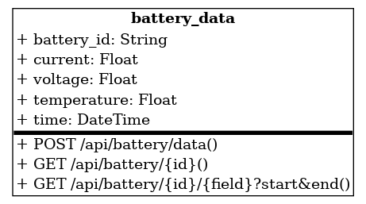

# 🔋 Battery Management System (BMS) - Backend API

This project implements a backend system to store and retrieve battery data from electric vehicles. It is built using **Node.js**, **Express**, and **SQLite**, and is designed to accept real-time data from multiple batteries every minute.

---

## 🚀 Technologies Used

- Node.js
- Express.js
- SQLite3
- RESTful API architecture

---

## 📁 Project Structure

```
battery-management-system/
├── controllers/
│   └── batteryController.js
├── routes/
│   └── batteryRoutes.js
├── database/
│   └── db.js
├── app.js
├── server.js
└── README.md
```

---

## 🗃️ Database Schema

**Table: `battery_data`**

| Column        | Type     | Description                           |
|---------------|----------|---------------------------------------|
| `id`          | INTEGER  | Primary key (auto-increment)          |
| `battery_id`  | TEXT     | Unique identifier of the battery      |
| `current`     | REAL     | Current output in amperes             |
| `voltage`     | REAL     | Voltage output in volts               |
| `temperature` | REAL     | Temperature in degrees Celsius        |
| `time`        | TEXT     | ISO 8601 formatted timestamp          |

✅ Index on `battery_id` and `time` for optimized queries.

---

## ⚙️ Setup Instructions

1. **Clone the repository:**
   ```bash
   git clone https://github.com/your-username/battery-management-system.git
   cd battery-management-system
   ```

2. **Install dependencies:**
   ```bash
   npm install
   ```

3. **Run the server:**
   ```bash
   node server.js
   ```

4. The server will run at: `http://localhost:4000`

---

## 📡 API Endpoints

### 🔸 `POST /api/battery/data`

Store battery data sent from electric vehicles.

**Request Body (JSON):**
```json
{
  "battery_id": "1001",
  "current": 15.2,
  "voltage": 48.7,
  "temperature": 35.5,
  "time": "2024-08-19T10:00:00Z"
}
```

---

### 🔸 `GET /api/battery/:id`

Retrieve **all records** for a specific battery.

**Example:**
```
GET /api/battery/1001
```

---

### 🔸 `GET /api/battery/:id/:field`

Retrieve a specific **field** (like `voltage`, `current`, or `temperature`) for a battery.

**Example:**
```
GET /api/battery/1001/voltage
```

---

### 🔸 `GET /api/battery/:id/:field?start=...&end=...`

Retrieve field values **within a time range**.

**Example:**
```
GET /api/battery/1001/voltage?start=2024-08-19T00:00:00Z&end=2024-08-20T00:00:00Z
```

---

## 🧪 Postman Testing Instructions

1. Open Postman.
2. Test each of these endpoints:
   - `POST /api/battery/data` with raw JSON body
   - `GET /api/battery/:id`
   - `GET /api/battery/:id/:field`
   - `GET /api/battery/:id/:field?start=...&end=...`

---

## 📷 UML Diagram


